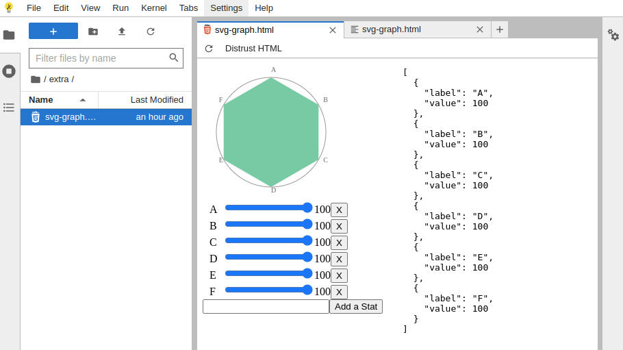

# Demo Single File Vue app: SVG Graph

Ref: https://vuejs.org/examples/#svg

**Objective**: Demo how to bring custom data viz built independently of the Jupyter ecosystem as standalone html files and make them availble in JupyterLite.

## Build

```sh
# install
pnpm install

# dev
pnpm run dev

# build
pnpm run build
# produces single file output: /dist/index.html
```

## Use in Jupyterlite as custom viz

- Replace string `__VIZ_INPUT_JSON__` by a json string with type `Points` and rename file say `svg-graph.html`.

  ```ts
  interface Point {
    label: string;
    value: number;
  }

  type Points = Array<Point>;
  ```

- Upload in [demo Jupyterlite](https://jupyterlite.readthedocs.io/en/latest/_static/lab/).
- Double-click on uploaded file `svg-graph.html`
- Click on `Trust HTML`

Result:


